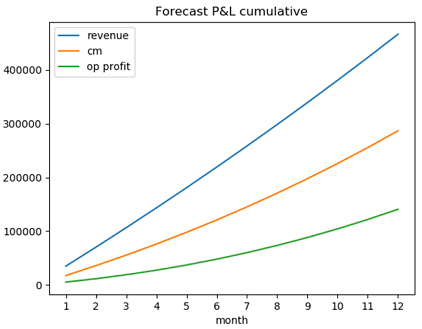

# Forecastr
> Quickly test financial viability of new products or services over a one year fiscal period

Forecastr calculates market sizing and segment parameters for new products or services, then compares
these against a forecast profit and loss projection plot to validate initial hypotheses.

  

## Usage example

Let's say you have some new software you are developing, you want to sell this on a SAAS basis.
You have some market data to work with - monthly sales, pricing and growth assumptions can be made with reasonable confidence.

**1. From your market data, enter:**

* Average estimated units shipped per month

* Estimated average sales price

* Target market segment you want to capture

* Estimate of how much this market will grow in percentage terms over a one year period

**2. Populate the fields for the actual profit & loss projection:**

* Estimated sales in the first month

* Your selling price

* The month-on-month sales growth you would like to achieve

* The month-on-month contribution margin growth desired

* Unit price increase month-on-month as a percentage

* Estimated cost of goods sold expense as a percentage

* Estimated revenue driven expenses as a percentage

* Estimated fixed cost base as a percentage

Forecatr will plot a P&L chart and compare initial segment size assumption against the actual P&L figures.

> If you are not familiar with the financial terms above see:

[Contribution Margin](https://www.investopedia.com/terms/c/contributionmargin.asp)

[Cost of Goods Sold Expense](https://www.investopedia.com/terms/c/cogs.asp)

[Revenue Driven Expenses / Operating Profit](https://www.investopedia.com/terms/o/operatingincome.asp)

[Fixed Costs](https://www.investopedia.com/terms/f/fixedcost.asp)

## Development setup

Use PIP to install from requirements.txt.
Ver. 0.0.2 runs on localhost only.

## Release History

* 0.0.2
    * *MVP for development and testing:*
    * **WIP:**
    * Separation of concerns - chart logic on separate route
    * WTForms, CSRF, may add persistence layer + sessions / user management
    * Finish styling (Bootstrap) 
    * Deployment code (gunicorn / Heroku)
    * Currency selection

## Meta

John Davidson – john.davidson.ctr@hotmail.co.uk

Distributed under the 2 Clause BSD licence. See ``Licence.txt`` for more information.

[My GitHub](https://github.com/John-E-Davidson72)

